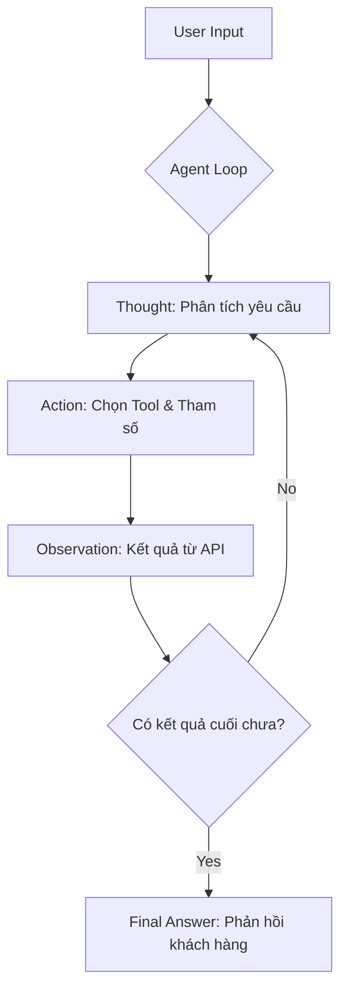

# Báo cáo Nhóm: Lab 3 - Hệ thống Agentic ReAct (Movie Assistant)

- **Tên Nhóm**: Movie Agent Master - Table A3
- **Thành viên**: Nguyễn Tuấn Kiệt, Nguyễn Văn Bách, Nguyễn Duy Hưng, Nguyễn Xuân Hoàng, Nguyễn Chí Hoàng, Nguyễn Đức Duy
- **Ngày thực hiện**: 2026-04-06

---

## 1. Tóm tắt điều hành (Executive Summary)

Mục tiêu của nhóm là xây dựng một Agent có khả năng tra cứu thông tin phim thời gian thực (real-time) để khắc phục nhược điểm "thiếu dữ liệu mới" của các mô hình LLM truyền thống.

- **Kết quả chính**: Agent đã sử dụng thành công Tool `recommend_movies` để truy xuất phim "Danger Zone" (2024) và cung cấp recommendation film với rating IMDB chính xác, thay vì hallucinate rating như chatbot cơ bản

---

## 2. Kiến trúc hệ thống & Công cụ (System Architecture & Tooling)

### 2.1 Sơ đồ luồng ReAct (Flowchart)

### 2.2 Danh mục công cụ (Tool Inventory)

| Tên Tool | Input Format | Mục đích sử dụng |
| :--- | :--- | :--- |
| `search_movies` | `name (string)` | Tìm kiếm phim theo tiêu đề hoặc từ khoá, return id. |
| `find_by_genre` |  `genre_id (int)` | Lọc danh sách phim theo mã thể loại (VD: 28 cho Phim hành động). |
| `get_details` | `movie_id (int)` | Lấy chi tiết cốt truyện và điểm rating của một bộ phim cụ thể. |
| `recommend_movie` | `movie_id(int)` | Gọi API để lấy recommend movie từ movie đang có, trong database của TMDB |

### 2.3 LLM Provider
- **Chính**: OpenAI gpt-4o (Độ chính xác cao trong việc gọi tool).
- **Alternative**: Gemini Flash Latest (nhanh hơn)
- **Phụ (Backup)**: Local Phi-3 (Dùng khi mất kết nối API hoặc tiết kiệm chi phí).

---

## 3. Telemetry & Hiệu năng (Performance Dashboard)

Dựa trên dữ liệu thực tế từ file `logs/2026-04-06.log`:

- **Độ trễ trung bình (Latency)**: ~4500ms (Bao gồm thời gian gọi API MovieDB và LLM suy luận, ).
- **Token tiêu thụ trung bình**: ~1400-2500 tokens/task (input + output).
- **Chi phí vận hành**: thấp (Tối ưu bằng cách giới hạn `max_steps = 10` để tránh lặp vô hạn).

---

## 4. Phân tích nguyên nhân lỗi (Root Cause Analysis - RCA)

### Case Study: không recommend movie theo API ở phiên bản v1
- **Vấn đề**: Ở bản v1, Agent `ReActAgent` khi nhận prompt đã tự autocomplete recommendation chứ không gọi recommendation API của TMDB. Việc lấy thông tin của phim hoạt động bình thuờng.
- **Hậu quả**: Recommendation dựa trên training data của model, có thể bị lỗi thời.
- **Nguyên nhân**: Chưa có tool rõ ràng cho việc recommend.
- **Target tool workflow**: Fetch movie id -> Fetch recommendation -> Fetch info of recommended movies
- **Actual flow**: Fetch movie id -> LLM complete recommendation instead -> Fetch id from recommended names -> Fetch info of recommended movies
- **Giải pháp (v2)**: Tạo tool `recommend_movies` để cho agent call khi đã có id của phim source. Bây giờ thì recommendation sẽ dựa trên API của TMDB với algorithm tốt thay vì autocomplete trong LLM core

---

## 5. Thử nghiệm So sánh (Ablation Studies)

| Tình huống | Prompt | Kết quả Chatbot | Kết quả Agent | Người thắng |
| :--- | :--- | :--- | :--- |
| Hỏi phim theo genre và năm |"Những bộ phim hành động hay nào ra mắt năm 2025 trở đi?" | Hallucinate phim - Knowledge cutoff (GPT-4o only - Gemini có cập nhật thông tin) | Tự tìm ra phim ra mắt trong năm 2025 và 2026 | **Agent** (except Gemini) |
| Hỏi phim dựa trên phim đang thích | "Hãy giới thiệu cho tôi những bộ phim hay nếu tôi thích Chúa tể những chiếc nhẫn." | Recommend list phim thành công, có mô tả | Recommend list phim thành công, nhưng có thêm rating IMDB đi kèm |

---

## 6. Đánh giá tính sẵn sàng Production (Production Readiness)

- **Bảo mật**: Input tham số Tool được xử lý qua hàm `strip()` và `int()` để tránh lỗi cú pháp.
- **Guardrails**: Thiết lập `max_steps` để ngắt Agent nếu nó rơi vào vòng lặp suy luận quẩn.
- **Mở rộng**: Hệ thống đã sẵn sàng để thêm các Tool đặt vé thực tế hoặc kết nối Database người dùng.

---

> [!IMPORTANT]
> Đây là bản báo cáo chính thức của nhóm **Movie Agent Master**. Toàn bộ mã nguồn và vết log đính kèm là bằng chứng thực tế cho quá trình làm việc.
