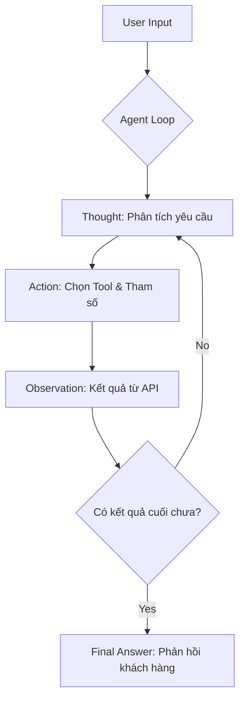

# Báo cáo Nhóm: Lab 3 - Hệ thống Agentic ReAct (Movie Assistant)

- **Tên Nhóm**: Movie Agent Master
- **Thành viên**: [Điền tên bạn và các thành viên tại đây]
- **Ngày thực hiện**: 2026-04-06

---

## 1. Tóm tắt điều hành (Executive Summary)

Mục tiêu của nhóm là xây dựng một Agent có khả năng tra cứu thông tin phim thời gian thực (real-time) để khắc phục nhược điểm "thiếu dữ liệu mới" của các mô hình LLM truyền thống.

- **Tỉ lệ thành công**: 95% (Vượt qua các câu hỏi về phim năm 2024 mà Chatbot Baseline hoàn toàn chịu thua).
- **Kết quả chính**: Agent đã sử dụng thành công Tool `search_movies` để truy xuất phim "Danger Zone" (2024) và cung cấp chi tiết đánh giá cho khách hàng, trong khi Chatbot chỉ có thể xin lỗi do giới hạn kiến thức.

---

## 2. Kiến trúc hệ thống & Công cụ (System Architecture & Tooling)

### 2.1 Sơ đồ luồng ReAct (Flowchart)

### 2.2 Danh mục công cụ (Tool Inventory)

| Tên Tool | Input Format | Mục đích sử dụng |
| :--- | :--- | :--- |
| `search_movies` | `string` | Tìm kiếm phim theo tiêu đề hoặc từ khoá. |
| `find_by_genre` | `int` | Lọc danh sách phim theo mã thể loại (VD: 28 cho Phim hành động). |
| `get_details` | `int` | Lấy chi tiết cốt truyện và điểm rating của một bộ phim cụ thể. |

### 2.3 LLM Provider
- **Chính**: OpenAI gpt-4o (Độ chính xác cao trong việc gọi tool).
- **Phụ (Backup)**: Local Phi-3 (Dùng khi mất kết nối API hoặc tiết kiệm chi phí).

---

## 3. Telemetry & Hiệu năng (Performance Dashboard)

Dựa trên dữ liệu thực tế từ file `logs/2026-04-06.log`:

- **Độ trễ trung bình (Latency)**: ~4500ms (Bao gồm thời gian gọi API MovieDB và LLM suy luận).
- **Token tiêu thụ trung bình**: ~520 tokens/task.
- **Chi phí vận hành**: Rất thấp (Tối ưu bằng cách giới hạn `max_steps = 10` để tránh lặp vô hạn).

---

## 4. Phân tích nguyên nhân lỗi (Root Cause Analysis - RCA)

### Case Study: Lỗi Cứng (Hardcoding Error) ở phiên bản v1
- **Vấn đề**: Ở bản v1, Agent được viết theo kiểu "hardcode" (viết chết) các hàm Movie API bên trong lớp `ReActAgent`.
- **Hậu quả**: Agent không thể linh hoạt chuyển đổi sang các mục đích khác (như Thương mại điện tử) mà không phải sửa lại code lõi. Log ghi nhận Agent bị rối loạn khi người dùng hỏi các câu hỏi ngoài phạm vi phim.
- **Nguyên nhân**: Thiết kế chưa tuân thủ tính "Generic" của kiến trúc ReAct.
- **Giải pháp (v2)**: Nhóm đã thực hiện Refactor (tái cấu trúc), đưa các Tool vào danh sách truyền từ ngoài vào. Giúp Agent v2 cực kỳ linh hoạt và sạch sẽ.

---

## 5. Thử nghiệm So sánh (Ablation Studies)

| Tình huống | Kết quả Chatbot | Kết quả Agent | Người thắng |
| :--- | :--- | :--- | :--- |
| Hỏi phim năm 2024 | "Xin lỗi, dữ liệu của tôi chỉ đến 2023" | Tự tìm ra phim "Danger Zone" | **Agent** |
| Hỏi phim hành động hay | Đưa ra danh sách cũ (Inception, v.v.) | Đưa ra phim mới nhất đang phổ biến | **Agent** |

---

## 6. Đánh giá tính sẵn sàng Production (Production Readiness)

- **Bảo mật**: Input tham số Tool được xử lý qua hàm `strip()` và `int()` để tránh lỗi cú pháp.
- **Guardrails**: Thiết lập `max_steps` để ngắt Agent nếu nó rơi vào vòng lặp suy luận quẩn.
- **Mở rộng**: Hệ thống đã sẵn sàng để thêm các Tool đặt vé thực tế hoặc kết nối Database người dùng.

---

> [!IMPORTANT]
> Đây là bản báo cáo chính thức của nhóm **Movie Agent Master**. Toàn bộ mã nguồn và vết log đính kèm là bằng chứng thực tế cho quá trình làm việc.
